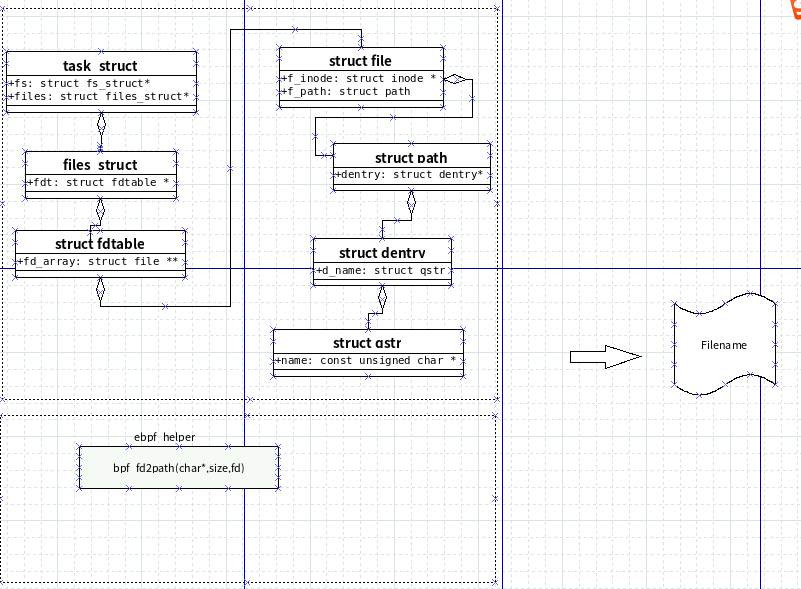

# 1.gala-filetrace

gala-filetrace是A-OPS中一个功能组件，主要用于对openEuler系统中配置文件实时监控,也可以监控信息推送到gala-ragdoll。
支持监控以下命令和系统调用：
#### vim/vi,sed,echo,cp,move
#### syscall write
---
# 2.实现架构

# 3.编译和运行
目前适配支持的openEuler版本:
| 系统版本      | 架构         |  适配          |说明          |
| :---         |    :----:   |          ---: |  ---: |
| openEuler 2203_SP3   | aarch64       |  OK   |无  |
| openEuler 2203_SP3   | x86           |  OK   |无  |
| openEuler 2403_SP1   | aarch64       |  OK   |无  |
| openEuler 2403_SP1   | x86           |  OK   |无  |
| openEuler 2503       | aarch64       |  OK   |需要在内核新增一个helper_func  |
| openEuler 2503       | x86           |  OK   |需要在内核新增一个helper_func  |
关于增加的helper_func接口fd2path，具体方法参照：3.内核升级。
---
### 3.1 依赖安装
| 系统版本      | 依赖安装         |
| :---         |    :----:   | 
| openEuler 2203_SP3   | # yum install bpftrace libcurl-devel libbpf-devel cpp-httplib-devel zlib-devel nlohmann-json-devel bpftool clang llvm  cpp-httplib-devel   |


### 3.2 编译
#### 3.2.1 直接编译
```bash
# make
#debug add bpf_printk cat /sys/kernel/debug/tracing/trace_pipe
#make DEBUG=1
    
```
#### 3.2.1 rpm构建
```bash
# wget -O ~/rpmbuild/SOURCES/master.zip https://gitee.com/openEuler/gala-filetrace/repository/archive/master.zip
# git clone https://gitee.com/openeuler/gala-filetrace.git
# rpmbuild  -ba config/gala-filetrace.spec  
```
构建成功后，再/root/rpmbuild/RPMS/目录下存在gala-filetrace的rpm包。

### 3.3 安装
#### 3.3.1 编译安装
```bash
# ./filetrace
```
#### 3.3.2 rpm安装
通过systemd来启动gala-filetrace
```bash
# .systemctl start gala-filatrace
```
## 3.4 配置说明
配置说明:
| 配置项        | 值         |  说明          |
| :---         |    :----:   |          ---: |
| host_id       | string          |     |
| domain_name       | string           |     |
| ragdoll_api       | string           |     |
| publish       | bool         |     是否推送到ragdoll |

# 4.内核升级
在内核6.6.0中，无法从task_struct中获取进程中fd列表了。所以只能通过在内核中增加接口来实现。
下图是从ebpf探针中获取文件名称的方法：


以下升级内核参照示例，具体需要根据实际环境执行。
### 4.1 kernel源码安装

yum download kernel-source-6.6.0-72.6.0.56.oe2503.x86_64

rpm -ivh kernel-source-6.6.0-72.6.0.56.oe2503.x86_64*

cp /boot/config-6.6.0-72.6.0.56.oe2503.x86_64 .config

#### 应用patch
patch -p1 < /path/to/my_patch.patch

### 4.2 编译
make O=out

### 4.3 安装模块
make O=out modules_install

默认安装到/lib/modules/

### 4.4  安装内核映像
make O=out install

安装（vmlinuz）、System.map、config 等到 /boot/
